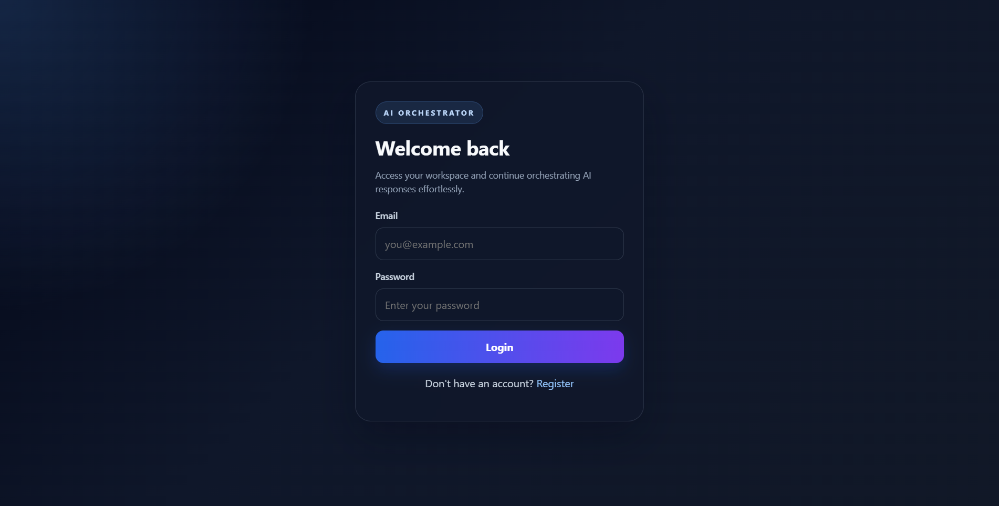
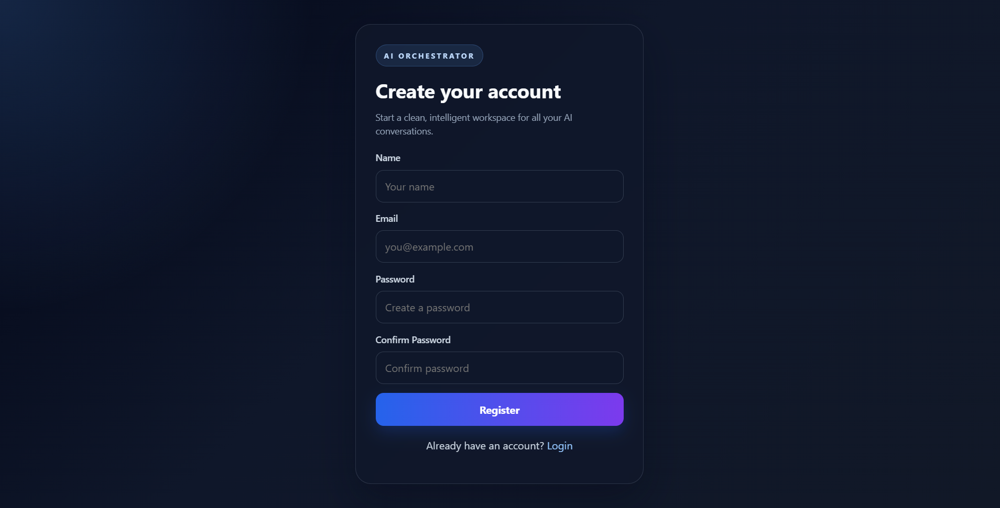
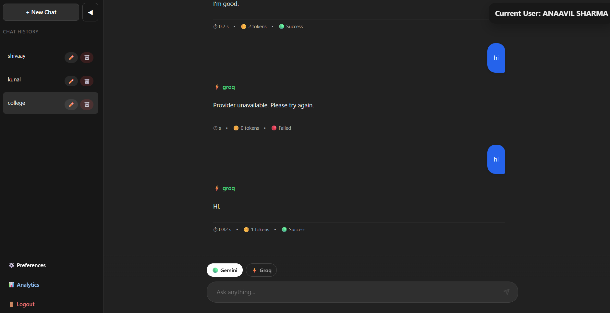
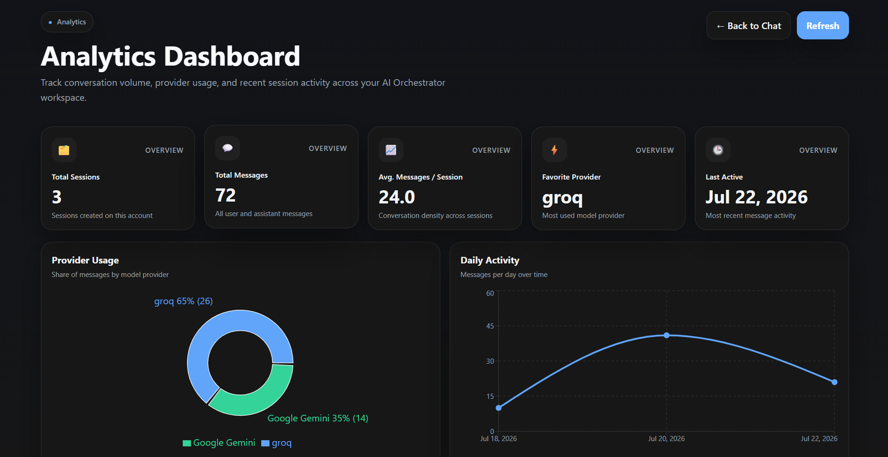
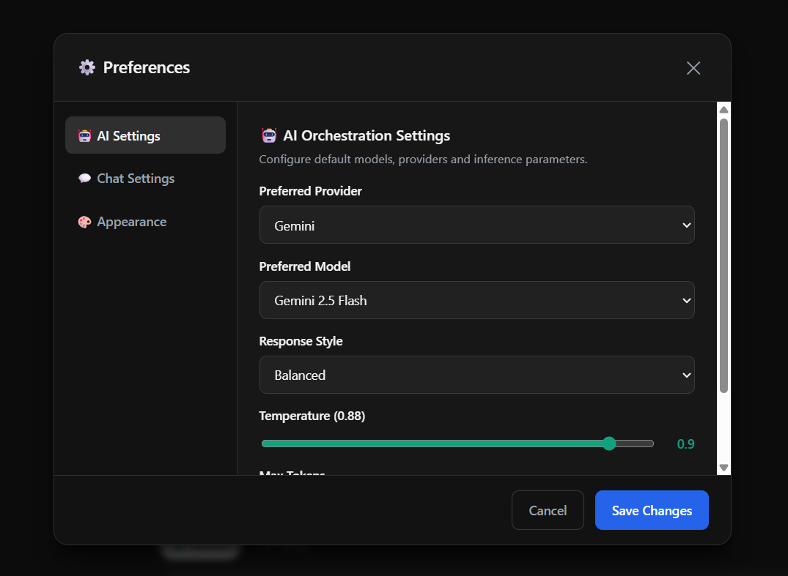

# 🤖 AI Orchestrator

<div align="center">

### 🚀 A Full-Stack Multi-Provider AI Platform with Authentication, Analytics & Intelligent Orchestration

[](https://www.python.org/)
[](https://fastapi.tiangolo.com/)
[](https://react.dev/)
[](https://vitejs.dev/)
[](https://www.postgresql.org/)
[](https://www.sqlalchemy.org/)
[](https://jwt.io/)
[](LICENSE)
[](https://github.com/nayanshankar17/ai-orchestrator/stargazers)
[](https://github.com/nayanshankar17/ai-orchestrator/network)
[]()

</div>

---

## 📖 Overview

**AI Orchestrator** is a full-stack AI platform that provides a unified interface for interacting with multiple Large Language Models (LLMs).

Instead of being locked to a single provider, users can seamlessly chat with multiple AI providers while enjoying features such as secure authentication, persistent chat history, user preferences, analytics dashboards, and intelligent request orchestration.

Designed with scalability in mind, the project follows a modular architecture that makes it easy to extend with new providers, tools, and AI agents.

---

## ✨ Key Features

- 🔐 JWT Authentication
- 💬 Multi-session Chat System
- 🤖 Multi-Provider AI Integration
- ⚡ FastAPI Backend
- ⚛️ React Frontend
- 🗄️ PostgreSQL Database
- 📊 Analytics Dashboard
- 📈 Provider Usage Statistics
- 🌙 Light / Dark Theme
- ⚙️ User Preferences
- 📜 Persistent Chat History
- 🚀 Modular Architecture
- 🔄 Easy Provider Expansion

---


# ✨ Features

## 🔐 Authentication

Secure user authentication built using JWT with encrypted password storage.

- User Registration
- Secure Login
- JWT Authentication
- Password Hashing (bcrypt)
- Protected API Routes
- Session Management

---

## 💬 Intelligent Chat System

A modern ChatGPT-inspired conversational interface.

### Features

- Multiple Chat Sessions
- Persistent Chat History
- Rename Chat Sessions
- Context-aware Conversations
- Responsive Chat Interface
- Real-time AI Responses

---

## 🤖 Multi-Provider AI Orchestration

Interact with multiple AI providers through a unified interface.

| Provider | Status |
|----------|--------|
| Google Gemini | ✅ Supported |
| Groq | ✅ Supported |
| Additional Providers | 🚧 Coming Soon |

### Capabilities

- Dynamic Provider Switching
- User Provider Preferences
- Model Preferences
- Unified API Layer
- Easy Provider Expansion

---

## 📊 Analytics Dashboard

Monitor usage and gain insights into conversations.

### Dashboard Includes

- 📈 Total Chat Sessions
- 💬 Total Messages
- ❤️ Favorite AI Provider
- 📊 Provider Usage Distribution
- 📅 Daily Activity Chart
- 📉 Conversation Statistics
- 🕒 Recent Activity Table

---

## ⚙️ User Preferences

Customize your AI experience.

- Preferred AI Provider
- Preferred AI Model
- Persistent User Settings
- Personalized Experience

---

## 🎨 Modern User Interface

Designed for simplicity and productivity.

- ChatGPT-inspired Design
- Responsive Layout
- Light Theme
- Dark Theme
- Interactive Charts
- Sidebar Navigation

---

# 📸 Application Screenshots

## 🔑 Login Page

<p align="center">
  
</p>

---

## 📝 Register Page

<p align="center">
  
</p>

---

## 💬 AI Chat Dashboard

<p align="center">
  
</p>

---

## 📊 Analytics Dashboard

<p align="center">
  
</p>

---

## ⚙️ User Preferences

<p align="center">
  
</p>

---

# 🏗️ System Architecture

```text
                    +---------------------------+
                    |      React Frontend       |
                    +-------------+-------------+
                                  |
                                  ▼
                    +---------------------------+
                    |      FastAPI Backend      |
                    +-------------+-------------+
                                  |
        +-------------------------+-------------------------+
        |                         |                         |
        ▼                         ▼                         ▼
+---------------+        +----------------+        +----------------+
| Authentication|        | AI Orchestrator|        |   Analytics    |
+---------------+        +----------------+        +----------------+
        |                         |                         |
        +------------+------------+------------+------------+
                     |                         |
                     ▼                         ▼
             +---------------------------------------+
             |         PostgreSQL Database           |
             +---------------------------------------+
                                 |
                                 ▼
                   +-------------------------------+
                   |       AI Provider Layer        |
                   +-------------------------------+
                   |                               |
          +----------------+              +----------------+ 
          | Google Gemini  |              |      Groq      |  
          +----------------+              +----------------+  
```

---

# 🏛️ Project Design

The project follows a layered architecture to keep components modular, scalable, and maintainable.

```text
React Frontend
       │
       ▼
API Routers
       │
       ▼
Business Logic (Services)
       │
       ▼
Database Models
       │
       ▼
PostgreSQL
       │
       ▼
External AI Providers
```

### Why this Architecture?

- Clean separation of concerns
- Easy to add new AI providers
- Scalable backend structure
- Reusable service layer
- Independent frontend and backend
- Ready for future AI agents and MCP integration

# 💡 Why AI Orchestrator?

Modern AI applications often rely on a single LLM provider, making it difficult to compare responses, switch providers, or personalize user experiences.

AI Orchestrator solves this by introducing a unified platform that abstracts multiple AI providers behind a single interface while providing authentication, persistent conversations, analytics, and user-specific preferences.

The project is designed with scalability in mind, making it easy to integrate additional providers, tools, and autonomous AI agents in future versions.
